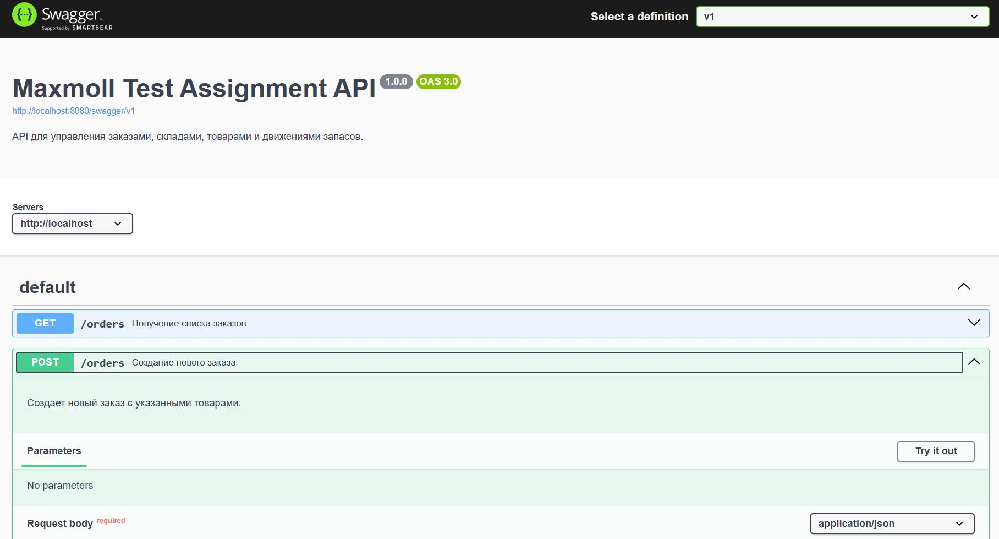
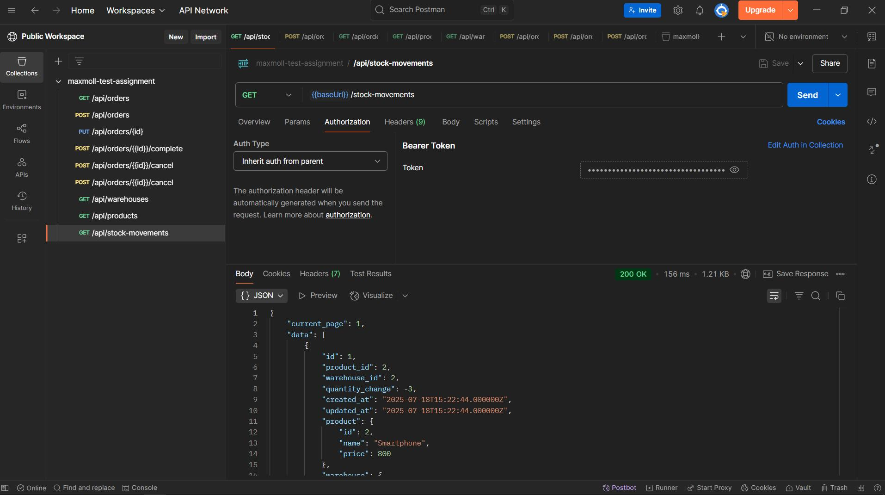

# Описание

### Данный проект предоставляет API для управления заказами, складами, товарами и движением их запасов на складе.

<br>

# Запуск проекта

## **Запуск в Docker-окружении**
```bash
1. Скачать удаленный репозиторий:
  $ git clone https://github.com/AlexanderKurenkov/maxmoll-test-assignment.git
  $ cd maxmoll-test-assignment

2. Создать файл .env на основе .env.example и указать значения переменных окружения:
  $ cp .env.example .env

3. Запустить сервисы из Compose-файла:
  # При первом запуске создается схема базы данных (файл /database/sql/schema.sql) и выполняются миграции.
  # При повторных запусках (когда уже создан именованный том) выполняются только миграции.
  $ docker-compose up -d

4. Выполнить команду db:seed для наполнения базы данных тестовыми данными:
  $ docker-compose exec php-fpm php artisan db:seed

5. Остановка и удаление запущенных контейнеров (вместе с именованными томами):
  $ docker-compose down -v

```

# API-маршруты

| HTTP-метод | Конечная точка | Описание |
|---|---|---|
| GET | `/api/v1/orders` | Получение списка заказов с фильтрацией и пагинацией |
| POST | `/api/v1/orders` | Создание нового заказа |
| PUT | `/api/v1/orders/{id}` | Обновление существующего заказа (без изменения статуса) |
| POST | `/api/v1/orders/{id}/complete` | Завершение заказа |
| POST | `/api/v1/orders/{id}/cancel` | Отмена заказа |
| POST | `/api/v1/orders/{id}/resume` | Возобновление отмененного заказа |
| GET | `/api/v1/warehouses` | Получение списка складов |
| GET | `/api/v1/products` | Получение списка товаров с их остатками по складам |
| GET | `/api/v1/stock-movements` | Получение списка движений товаров с фильтрацией |

## Документация API

Документации API в формате OpenAPI доступна по маршруту `/swagger`.

<p align="center">
  
</p>

## Тестирование API

Для тестирования API была создана Postman-коллекция, доступная по ссылке: [Maxmoll Test Assignment](https://www.postman.com/spaceflight-participant-52368985/public-workspace/collection/agr5jx7/maxmoll-test-assignment)

<p align="center">
  
</p>

### **Примечание:**
Так как укаазнные API-маршруты являются защищенными, то для их тестирования необходимо передавать Bearer-токен в заголовке запроса.

Например, можно получить токен для авторизации с помощью `tinker`, выполнив следующие команды:

```php
$user = new \App\Models\User();
$user->name = 'Admin';
$user->email = 'admin@example.com';
$user->password = bcrypt('not-a-secure-password');
$user->save();

$token = $user->createToken('orders-token')->plainTextToken;
echo $token; // Будет выведена строка с токеном в формате `<id>|<токен>`
```
